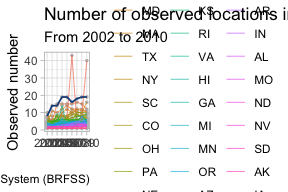
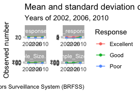

pubh7462_hw2
================
Xiao Ma

# 3.1 Data Exploration & Cleaning

``` r
library(DataExplorer)
library(tidyverse)
library(scales)
library(ggplot2)
library(gt)
library(ggrepel)
library(paletteer)
BRFSS <- read.csv("./data/brfss_smart_2010.csv", stringsAsFactors=TRUE)
#names(BRFSS)
brfss2 <- BRFSS %>%
  separate(col = Locationdesc, into = c("State","2","County"), sep = " ") %>%
  mutate(Prop_response=Data_value) %>%
  filter(Topic=="Overall Health") %>%
  select(Year,State,County,Response,Sample_Size,Prop_response)
brfss2$Year<-as.factor(brfss2$Year)
brfss2$State<-as.factor(brfss2$State)
brfss2$County<-as.factor(brfss2$County)
```

# 3.2 Data Description

-   There are 10625 observations and 6 variables after data cleaning.
-   Each case is a unique contain the Year, State, County, Response,
    Sample size, Proportion of response.
-   Year, State, County, Response are quite intuitive and
    straightforward, Response describes the content of response, Sample
    size describes the observed locations, Prop_response states the
    Proportion of response when respondents filling in the
    questionnaire.
-   Each one observed locations have more than one response.

# 3.3 Do Data Science

# 3.3.1

``` r
brfss2 %>%
  filter(Year==2004) %>%
  distinct(State, County) %>% #exclude duplicate
  group_by(State) %>%
  summarise(Locations=n()) %>%
  filter(Locations==6) %>%
  gt() %>%
  tab_header(title = "States observed at 6 locations") %>%
  tab_source_note(source_note = "Data source: Behavioral Risk Factors Surveillance System")
```

<div id="fgarimctab" style="overflow-x:auto;overflow-y:auto;width:auto;height:auto;">
<style>html {
  font-family: -apple-system, BlinkMacSystemFont, 'Segoe UI', Roboto, Oxygen, Ubuntu, Cantarell, 'Helvetica Neue', 'Fira Sans', 'Droid Sans', Arial, sans-serif;
}

#fgarimctab .gt_table {
  display: table;
  border-collapse: collapse;
  margin-left: auto;
  margin-right: auto;
  color: #333333;
  font-size: 16px;
  font-weight: normal;
  font-style: normal;
  background-color: #FFFFFF;
  width: auto;
  border-top-style: solid;
  border-top-width: 2px;
  border-top-color: #A8A8A8;
  border-right-style: none;
  border-right-width: 2px;
  border-right-color: #D3D3D3;
  border-bottom-style: solid;
  border-bottom-width: 2px;
  border-bottom-color: #A8A8A8;
  border-left-style: none;
  border-left-width: 2px;
  border-left-color: #D3D3D3;
}

#fgarimctab .gt_heading {
  background-color: #FFFFFF;
  text-align: center;
  border-bottom-color: #FFFFFF;
  border-left-style: none;
  border-left-width: 1px;
  border-left-color: #D3D3D3;
  border-right-style: none;
  border-right-width: 1px;
  border-right-color: #D3D3D3;
}

#fgarimctab .gt_title {
  color: #333333;
  font-size: 125%;
  font-weight: initial;
  padding-top: 4px;
  padding-bottom: 4px;
  padding-left: 5px;
  padding-right: 5px;
  border-bottom-color: #FFFFFF;
  border-bottom-width: 0;
}

#fgarimctab .gt_subtitle {
  color: #333333;
  font-size: 85%;
  font-weight: initial;
  padding-top: 0;
  padding-bottom: 6px;
  padding-left: 5px;
  padding-right: 5px;
  border-top-color: #FFFFFF;
  border-top-width: 0;
}

#fgarimctab .gt_bottom_border {
  border-bottom-style: solid;
  border-bottom-width: 2px;
  border-bottom-color: #D3D3D3;
}

#fgarimctab .gt_col_headings {
  border-top-style: solid;
  border-top-width: 2px;
  border-top-color: #D3D3D3;
  border-bottom-style: solid;
  border-bottom-width: 2px;
  border-bottom-color: #D3D3D3;
  border-left-style: none;
  border-left-width: 1px;
  border-left-color: #D3D3D3;
  border-right-style: none;
  border-right-width: 1px;
  border-right-color: #D3D3D3;
}

#fgarimctab .gt_col_heading {
  color: #333333;
  background-color: #FFFFFF;
  font-size: 100%;
  font-weight: normal;
  text-transform: inherit;
  border-left-style: none;
  border-left-width: 1px;
  border-left-color: #D3D3D3;
  border-right-style: none;
  border-right-width: 1px;
  border-right-color: #D3D3D3;
  vertical-align: bottom;
  padding-top: 5px;
  padding-bottom: 6px;
  padding-left: 5px;
  padding-right: 5px;
  overflow-x: hidden;
}

#fgarimctab .gt_column_spanner_outer {
  color: #333333;
  background-color: #FFFFFF;
  font-size: 100%;
  font-weight: normal;
  text-transform: inherit;
  padding-top: 0;
  padding-bottom: 0;
  padding-left: 4px;
  padding-right: 4px;
}

#fgarimctab .gt_column_spanner_outer:first-child {
  padding-left: 0;
}

#fgarimctab .gt_column_spanner_outer:last-child {
  padding-right: 0;
}

#fgarimctab .gt_column_spanner {
  border-bottom-style: solid;
  border-bottom-width: 2px;
  border-bottom-color: #D3D3D3;
  vertical-align: bottom;
  padding-top: 5px;
  padding-bottom: 5px;
  overflow-x: hidden;
  display: inline-block;
  width: 100%;
}

#fgarimctab .gt_group_heading {
  padding-top: 8px;
  padding-bottom: 8px;
  padding-left: 5px;
  padding-right: 5px;
  color: #333333;
  background-color: #FFFFFF;
  font-size: 100%;
  font-weight: initial;
  text-transform: inherit;
  border-top-style: solid;
  border-top-width: 2px;
  border-top-color: #D3D3D3;
  border-bottom-style: solid;
  border-bottom-width: 2px;
  border-bottom-color: #D3D3D3;
  border-left-style: none;
  border-left-width: 1px;
  border-left-color: #D3D3D3;
  border-right-style: none;
  border-right-width: 1px;
  border-right-color: #D3D3D3;
  vertical-align: middle;
}

#fgarimctab .gt_empty_group_heading {
  padding: 0.5px;
  color: #333333;
  background-color: #FFFFFF;
  font-size: 100%;
  font-weight: initial;
  border-top-style: solid;
  border-top-width: 2px;
  border-top-color: #D3D3D3;
  border-bottom-style: solid;
  border-bottom-width: 2px;
  border-bottom-color: #D3D3D3;
  vertical-align: middle;
}

#fgarimctab .gt_from_md > :first-child {
  margin-top: 0;
}

#fgarimctab .gt_from_md > :last-child {
  margin-bottom: 0;
}

#fgarimctab .gt_row {
  padding-top: 8px;
  padding-bottom: 8px;
  padding-left: 5px;
  padding-right: 5px;
  margin: 10px;
  border-top-style: solid;
  border-top-width: 1px;
  border-top-color: #D3D3D3;
  border-left-style: none;
  border-left-width: 1px;
  border-left-color: #D3D3D3;
  border-right-style: none;
  border-right-width: 1px;
  border-right-color: #D3D3D3;
  vertical-align: middle;
  overflow-x: hidden;
}

#fgarimctab .gt_stub {
  color: #333333;
  background-color: #FFFFFF;
  font-size: 100%;
  font-weight: initial;
  text-transform: inherit;
  border-right-style: solid;
  border-right-width: 2px;
  border-right-color: #D3D3D3;
  padding-left: 5px;
  padding-right: 5px;
}

#fgarimctab .gt_stub_row_group {
  color: #333333;
  background-color: #FFFFFF;
  font-size: 100%;
  font-weight: initial;
  text-transform: inherit;
  border-right-style: solid;
  border-right-width: 2px;
  border-right-color: #D3D3D3;
  padding-left: 5px;
  padding-right: 5px;
  vertical-align: top;
}

#fgarimctab .gt_row_group_first td {
  border-top-width: 2px;
}

#fgarimctab .gt_summary_row {
  color: #333333;
  background-color: #FFFFFF;
  text-transform: inherit;
  padding-top: 8px;
  padding-bottom: 8px;
  padding-left: 5px;
  padding-right: 5px;
}

#fgarimctab .gt_first_summary_row {
  border-top-style: solid;
  border-top-color: #D3D3D3;
}

#fgarimctab .gt_first_summary_row.thick {
  border-top-width: 2px;
}

#fgarimctab .gt_last_summary_row {
  padding-top: 8px;
  padding-bottom: 8px;
  padding-left: 5px;
  padding-right: 5px;
  border-bottom-style: solid;
  border-bottom-width: 2px;
  border-bottom-color: #D3D3D3;
}

#fgarimctab .gt_grand_summary_row {
  color: #333333;
  background-color: #FFFFFF;
  text-transform: inherit;
  padding-top: 8px;
  padding-bottom: 8px;
  padding-left: 5px;
  padding-right: 5px;
}

#fgarimctab .gt_first_grand_summary_row {
  padding-top: 8px;
  padding-bottom: 8px;
  padding-left: 5px;
  padding-right: 5px;
  border-top-style: double;
  border-top-width: 6px;
  border-top-color: #D3D3D3;
}

#fgarimctab .gt_striped {
  background-color: rgba(128, 128, 128, 0.05);
}

#fgarimctab .gt_table_body {
  border-top-style: solid;
  border-top-width: 2px;
  border-top-color: #D3D3D3;
  border-bottom-style: solid;
  border-bottom-width: 2px;
  border-bottom-color: #D3D3D3;
}

#fgarimctab .gt_footnotes {
  color: #333333;
  background-color: #FFFFFF;
  border-bottom-style: none;
  border-bottom-width: 2px;
  border-bottom-color: #D3D3D3;
  border-left-style: none;
  border-left-width: 2px;
  border-left-color: #D3D3D3;
  border-right-style: none;
  border-right-width: 2px;
  border-right-color: #D3D3D3;
}

#fgarimctab .gt_footnote {
  margin: 0px;
  font-size: 90%;
  padding-left: 4px;
  padding-right: 4px;
  padding-left: 5px;
  padding-right: 5px;
}

#fgarimctab .gt_sourcenotes {
  color: #333333;
  background-color: #FFFFFF;
  border-bottom-style: none;
  border-bottom-width: 2px;
  border-bottom-color: #D3D3D3;
  border-left-style: none;
  border-left-width: 2px;
  border-left-color: #D3D3D3;
  border-right-style: none;
  border-right-width: 2px;
  border-right-color: #D3D3D3;
}

#fgarimctab .gt_sourcenote {
  font-size: 90%;
  padding-top: 4px;
  padding-bottom: 4px;
  padding-left: 5px;
  padding-right: 5px;
}

#fgarimctab .gt_left {
  text-align: left;
}

#fgarimctab .gt_center {
  text-align: center;
}

#fgarimctab .gt_right {
  text-align: right;
  font-variant-numeric: tabular-nums;
}

#fgarimctab .gt_font_normal {
  font-weight: normal;
}

#fgarimctab .gt_font_bold {
  font-weight: bold;
}

#fgarimctab .gt_font_italic {
  font-style: italic;
}

#fgarimctab .gt_super {
  font-size: 65%;
}

#fgarimctab .gt_footnote_marks {
  font-style: italic;
  font-weight: normal;
  font-size: 75%;
  vertical-align: 0.4em;
}

#fgarimctab .gt_asterisk {
  font-size: 100%;
  vertical-align: 0;
}

#fgarimctab .gt_slash_mark {
  font-size: 0.7em;
  line-height: 0.7em;
  vertical-align: 0.15em;
}

#fgarimctab .gt_fraction_numerator {
  font-size: 0.6em;
  line-height: 0.6em;
  vertical-align: 0.45em;
}

#fgarimctab .gt_fraction_denominator {
  font-size: 0.6em;
  line-height: 0.6em;
  vertical-align: -0.05em;
}
</style>
<table class="gt_table">
  <thead class="gt_header">
    <tr>
      <th colspan="2" class="gt_heading gt_title gt_font_normal gt_bottom_border" style>States observed at 6 locations</th>
    </tr>
    
  </thead>
  <thead class="gt_col_headings">
    <tr>
      <th class="gt_col_heading gt_columns_bottom_border gt_center" rowspan="1" colspan="1">State</th>
      <th class="gt_col_heading gt_columns_bottom_border gt_right" rowspan="1" colspan="1">Locations</th>
    </tr>
  </thead>
  <tbody class="gt_table_body">
    <tr><td class="gt_row gt_center">CO</td>
<td class="gt_row gt_right">6</td></tr>
    <tr><td class="gt_row gt_center">NM</td>
<td class="gt_row gt_right">6</td></tr>
    <tr><td class="gt_row gt_center">SC</td>
<td class="gt_row gt_right">6</td></tr>
    <tr><td class="gt_row gt_center">TX</td>
<td class="gt_row gt_right">6</td></tr>
    <tr><td class="gt_row gt_center">UT</td>
<td class="gt_row gt_right">6</td></tr>
    <tr><td class="gt_row gt_center">VT</td>
<td class="gt_row gt_right">6</td></tr>
  </tbody>
  <tfoot class="gt_sourcenotes">
    <tr>
      <td class="gt_sourcenote" colspan="2">Data source: Behavioral Risk Factors Surveillance System</td>
    </tr>
  </tfoot>
  
</table>
</div>

-   CO, NM, SC, TX, UT, VT are states observed at 6 locations.

# 3.3.2

``` r
brfss3 <- brfss2 %>% #subset the data we need
  distinct(State, County,Year) %>%
  group_by(Year,State) %>%
  summarise(Oberved_location=n()) %>%
  ungroup(Year,State) %>%
  mutate(State=fct_reorder(State,Oberved_location,mean,.desc = TRUE)) 

brfss3 %>%
  ggplot(aes(x=Year,y=Oberved_location,group=State,color=State)) +  
  geom_point(color = "grey", size = 0.5) +
  geom_line(size = 0.3, alpha = 0.8) +
  geom_line(data =brfss3[brfss3$State=="NJ",], #let the NJ stand out
            aes(x=Year,y=Oberved_location), 
            color = "dodgerblue4", size = 0.6) + 
  geom_label(label="New Jersey", x=2004,y=24.2,label.padding = unit(0.55, "lines"), 
    label.size = 0.35,
    color = "dodgerblue4",
    fill="white")+
  xlab("")+
  ylab("Observed number")+
  theme_light()+
  labs(title = "Number of observed locations in each state",
       subtitle = "From 2002 to 2010",
        caption = "Data from the Behavioral Risk Factors Surveillance System (BRFSS)")
```

<!-- -->

-   There are some fluctuations of each states during years, but the
    line do not have a clear increasing or decreasing pattern.
-   It’s noteworthy that Florida had distinct change during the years.

# 3.3.3

``` r
brfss4 <- brfss2 %>%
  filter(State=="MN",Year %in% c(2002,2006,2010),Response %in% c("Excellent","Good","Poor")) %>%
  group_by(Year,Response) %>%
  summarise(across(c(Sample_Size,Prop_response),  list(mean = mean, sd = sd), na.rm=FALSE, .names = "{.col}.{.fn}"))

brfss4 %>%
  gt() %>%
  fmt_number(columns = vars(Sample_Size.mean,Sample_Size.sd,Prop_response.mean,Prop_response.sd), 
             decimals = 2) %>%
  fmt_percent(columns = vars(Prop_response.mean), 
              decimals = 2, 
              scale_values = FALSE) %>%#change the value into percent
  tab_header(title = "Mean and standard deviation of responses",subtitle = "Years of 2002, 2006, 2010, Responses: sample size and proportion") %>%
  tab_source_note(source_note = "Data source: Behavioral Risk Factors Surveillance System")
```

<div id="lrifqqryhx" style="overflow-x:auto;overflow-y:auto;width:auto;height:auto;">
<style>html {
  font-family: -apple-system, BlinkMacSystemFont, 'Segoe UI', Roboto, Oxygen, Ubuntu, Cantarell, 'Helvetica Neue', 'Fira Sans', 'Droid Sans', Arial, sans-serif;
}

#lrifqqryhx .gt_table {
  display: table;
  border-collapse: collapse;
  margin-left: auto;
  margin-right: auto;
  color: #333333;
  font-size: 16px;
  font-weight: normal;
  font-style: normal;
  background-color: #FFFFFF;
  width: auto;
  border-top-style: solid;
  border-top-width: 2px;
  border-top-color: #A8A8A8;
  border-right-style: none;
  border-right-width: 2px;
  border-right-color: #D3D3D3;
  border-bottom-style: solid;
  border-bottom-width: 2px;
  border-bottom-color: #A8A8A8;
  border-left-style: none;
  border-left-width: 2px;
  border-left-color: #D3D3D3;
}

#lrifqqryhx .gt_heading {
  background-color: #FFFFFF;
  text-align: center;
  border-bottom-color: #FFFFFF;
  border-left-style: none;
  border-left-width: 1px;
  border-left-color: #D3D3D3;
  border-right-style: none;
  border-right-width: 1px;
  border-right-color: #D3D3D3;
}

#lrifqqryhx .gt_title {
  color: #333333;
  font-size: 125%;
  font-weight: initial;
  padding-top: 4px;
  padding-bottom: 4px;
  padding-left: 5px;
  padding-right: 5px;
  border-bottom-color: #FFFFFF;
  border-bottom-width: 0;
}

#lrifqqryhx .gt_subtitle {
  color: #333333;
  font-size: 85%;
  font-weight: initial;
  padding-top: 0;
  padding-bottom: 6px;
  padding-left: 5px;
  padding-right: 5px;
  border-top-color: #FFFFFF;
  border-top-width: 0;
}

#lrifqqryhx .gt_bottom_border {
  border-bottom-style: solid;
  border-bottom-width: 2px;
  border-bottom-color: #D3D3D3;
}

#lrifqqryhx .gt_col_headings {
  border-top-style: solid;
  border-top-width: 2px;
  border-top-color: #D3D3D3;
  border-bottom-style: solid;
  border-bottom-width: 2px;
  border-bottom-color: #D3D3D3;
  border-left-style: none;
  border-left-width: 1px;
  border-left-color: #D3D3D3;
  border-right-style: none;
  border-right-width: 1px;
  border-right-color: #D3D3D3;
}

#lrifqqryhx .gt_col_heading {
  color: #333333;
  background-color: #FFFFFF;
  font-size: 100%;
  font-weight: normal;
  text-transform: inherit;
  border-left-style: none;
  border-left-width: 1px;
  border-left-color: #D3D3D3;
  border-right-style: none;
  border-right-width: 1px;
  border-right-color: #D3D3D3;
  vertical-align: bottom;
  padding-top: 5px;
  padding-bottom: 6px;
  padding-left: 5px;
  padding-right: 5px;
  overflow-x: hidden;
}

#lrifqqryhx .gt_column_spanner_outer {
  color: #333333;
  background-color: #FFFFFF;
  font-size: 100%;
  font-weight: normal;
  text-transform: inherit;
  padding-top: 0;
  padding-bottom: 0;
  padding-left: 4px;
  padding-right: 4px;
}

#lrifqqryhx .gt_column_spanner_outer:first-child {
  padding-left: 0;
}

#lrifqqryhx .gt_column_spanner_outer:last-child {
  padding-right: 0;
}

#lrifqqryhx .gt_column_spanner {
  border-bottom-style: solid;
  border-bottom-width: 2px;
  border-bottom-color: #D3D3D3;
  vertical-align: bottom;
  padding-top: 5px;
  padding-bottom: 5px;
  overflow-x: hidden;
  display: inline-block;
  width: 100%;
}

#lrifqqryhx .gt_group_heading {
  padding-top: 8px;
  padding-bottom: 8px;
  padding-left: 5px;
  padding-right: 5px;
  color: #333333;
  background-color: #FFFFFF;
  font-size: 100%;
  font-weight: initial;
  text-transform: inherit;
  border-top-style: solid;
  border-top-width: 2px;
  border-top-color: #D3D3D3;
  border-bottom-style: solid;
  border-bottom-width: 2px;
  border-bottom-color: #D3D3D3;
  border-left-style: none;
  border-left-width: 1px;
  border-left-color: #D3D3D3;
  border-right-style: none;
  border-right-width: 1px;
  border-right-color: #D3D3D3;
  vertical-align: middle;
}

#lrifqqryhx .gt_empty_group_heading {
  padding: 0.5px;
  color: #333333;
  background-color: #FFFFFF;
  font-size: 100%;
  font-weight: initial;
  border-top-style: solid;
  border-top-width: 2px;
  border-top-color: #D3D3D3;
  border-bottom-style: solid;
  border-bottom-width: 2px;
  border-bottom-color: #D3D3D3;
  vertical-align: middle;
}

#lrifqqryhx .gt_from_md > :first-child {
  margin-top: 0;
}

#lrifqqryhx .gt_from_md > :last-child {
  margin-bottom: 0;
}

#lrifqqryhx .gt_row {
  padding-top: 8px;
  padding-bottom: 8px;
  padding-left: 5px;
  padding-right: 5px;
  margin: 10px;
  border-top-style: solid;
  border-top-width: 1px;
  border-top-color: #D3D3D3;
  border-left-style: none;
  border-left-width: 1px;
  border-left-color: #D3D3D3;
  border-right-style: none;
  border-right-width: 1px;
  border-right-color: #D3D3D3;
  vertical-align: middle;
  overflow-x: hidden;
}

#lrifqqryhx .gt_stub {
  color: #333333;
  background-color: #FFFFFF;
  font-size: 100%;
  font-weight: initial;
  text-transform: inherit;
  border-right-style: solid;
  border-right-width: 2px;
  border-right-color: #D3D3D3;
  padding-left: 5px;
  padding-right: 5px;
}

#lrifqqryhx .gt_stub_row_group {
  color: #333333;
  background-color: #FFFFFF;
  font-size: 100%;
  font-weight: initial;
  text-transform: inherit;
  border-right-style: solid;
  border-right-width: 2px;
  border-right-color: #D3D3D3;
  padding-left: 5px;
  padding-right: 5px;
  vertical-align: top;
}

#lrifqqryhx .gt_row_group_first td {
  border-top-width: 2px;
}

#lrifqqryhx .gt_summary_row {
  color: #333333;
  background-color: #FFFFFF;
  text-transform: inherit;
  padding-top: 8px;
  padding-bottom: 8px;
  padding-left: 5px;
  padding-right: 5px;
}

#lrifqqryhx .gt_first_summary_row {
  border-top-style: solid;
  border-top-color: #D3D3D3;
}

#lrifqqryhx .gt_first_summary_row.thick {
  border-top-width: 2px;
}

#lrifqqryhx .gt_last_summary_row {
  padding-top: 8px;
  padding-bottom: 8px;
  padding-left: 5px;
  padding-right: 5px;
  border-bottom-style: solid;
  border-bottom-width: 2px;
  border-bottom-color: #D3D3D3;
}

#lrifqqryhx .gt_grand_summary_row {
  color: #333333;
  background-color: #FFFFFF;
  text-transform: inherit;
  padding-top: 8px;
  padding-bottom: 8px;
  padding-left: 5px;
  padding-right: 5px;
}

#lrifqqryhx .gt_first_grand_summary_row {
  padding-top: 8px;
  padding-bottom: 8px;
  padding-left: 5px;
  padding-right: 5px;
  border-top-style: double;
  border-top-width: 6px;
  border-top-color: #D3D3D3;
}

#lrifqqryhx .gt_striped {
  background-color: rgba(128, 128, 128, 0.05);
}

#lrifqqryhx .gt_table_body {
  border-top-style: solid;
  border-top-width: 2px;
  border-top-color: #D3D3D3;
  border-bottom-style: solid;
  border-bottom-width: 2px;
  border-bottom-color: #D3D3D3;
}

#lrifqqryhx .gt_footnotes {
  color: #333333;
  background-color: #FFFFFF;
  border-bottom-style: none;
  border-bottom-width: 2px;
  border-bottom-color: #D3D3D3;
  border-left-style: none;
  border-left-width: 2px;
  border-left-color: #D3D3D3;
  border-right-style: none;
  border-right-width: 2px;
  border-right-color: #D3D3D3;
}

#lrifqqryhx .gt_footnote {
  margin: 0px;
  font-size: 90%;
  padding-left: 4px;
  padding-right: 4px;
  padding-left: 5px;
  padding-right: 5px;
}

#lrifqqryhx .gt_sourcenotes {
  color: #333333;
  background-color: #FFFFFF;
  border-bottom-style: none;
  border-bottom-width: 2px;
  border-bottom-color: #D3D3D3;
  border-left-style: none;
  border-left-width: 2px;
  border-left-color: #D3D3D3;
  border-right-style: none;
  border-right-width: 2px;
  border-right-color: #D3D3D3;
}

#lrifqqryhx .gt_sourcenote {
  font-size: 90%;
  padding-top: 4px;
  padding-bottom: 4px;
  padding-left: 5px;
  padding-right: 5px;
}

#lrifqqryhx .gt_left {
  text-align: left;
}

#lrifqqryhx .gt_center {
  text-align: center;
}

#lrifqqryhx .gt_right {
  text-align: right;
  font-variant-numeric: tabular-nums;
}

#lrifqqryhx .gt_font_normal {
  font-weight: normal;
}

#lrifqqryhx .gt_font_bold {
  font-weight: bold;
}

#lrifqqryhx .gt_font_italic {
  font-style: italic;
}

#lrifqqryhx .gt_super {
  font-size: 65%;
}

#lrifqqryhx .gt_footnote_marks {
  font-style: italic;
  font-weight: normal;
  font-size: 75%;
  vertical-align: 0.4em;
}

#lrifqqryhx .gt_asterisk {
  font-size: 100%;
  vertical-align: 0;
}

#lrifqqryhx .gt_slash_mark {
  font-size: 0.7em;
  line-height: 0.7em;
  vertical-align: 0.15em;
}

#lrifqqryhx .gt_fraction_numerator {
  font-size: 0.6em;
  line-height: 0.6em;
  vertical-align: 0.45em;
}

#lrifqqryhx .gt_fraction_denominator {
  font-size: 0.6em;
  line-height: 0.6em;
  vertical-align: -0.05em;
}
</style>
<table class="gt_table">
  <thead class="gt_header">
    <tr>
      <th colspan="5" class="gt_heading gt_title gt_font_normal" style>Mean and standard deviation of responses</th>
    </tr>
    <tr>
      <th colspan="5" class="gt_heading gt_subtitle gt_font_normal gt_bottom_border" style>Years of 2002, 2006, 2010, Responses: sample size and proportion</th>
    </tr>
  </thead>
  <thead class="gt_col_headings">
    <tr>
      <th class="gt_col_heading gt_columns_bottom_border gt_center" rowspan="1" colspan="1">Response</th>
      <th class="gt_col_heading gt_columns_bottom_border gt_right" rowspan="1" colspan="1">Sample_Size.mean</th>
      <th class="gt_col_heading gt_columns_bottom_border gt_right" rowspan="1" colspan="1">Sample_Size.sd</th>
      <th class="gt_col_heading gt_columns_bottom_border gt_right" rowspan="1" colspan="1">Prop_response.mean</th>
      <th class="gt_col_heading gt_columns_bottom_border gt_right" rowspan="1" colspan="1">Prop_response.sd</th>
    </tr>
  </thead>
  <tbody class="gt_table_body">
    <tr class="gt_group_heading_row">
      <td colspan="5" class="gt_group_heading">2002</td>
    </tr>
    <tr class="gt_row_group_first"><td class="gt_row gt_center">Excellent</td>
<td class="gt_row gt_right">116.00</td>
<td class="gt_row gt_right">83.27</td>
<td class="gt_row gt_right">24.15%</td>
<td class="gt_row gt_right">3.54</td></tr>
    <tr><td class="gt_row gt_center">Good</td>
<td class="gt_row gt_right">123.75</td>
<td class="gt_row gt_right">84.26</td>
<td class="gt_row gt_right">23.95%</td>
<td class="gt_row gt_right">1.05</td></tr>
    <tr><td class="gt_row gt_center">Poor</td>
<td class="gt_row gt_right">13.75</td>
<td class="gt_row gt_right">9.57</td>
<td class="gt_row gt_right">2.40%</td>
<td class="gt_row gt_right">1.17</td></tr>
    <tr class="gt_group_heading_row">
      <td colspan="5" class="gt_group_heading">2006</td>
    </tr>
    <tr class="gt_row_group_first"><td class="gt_row gt_center">Excellent</td>
<td class="gt_row gt_right">122.33</td>
<td class="gt_row gt_right">72.62</td>
<td class="gt_row gt_right">23.83%</td>
<td class="gt_row gt_right">2.99</td></tr>
    <tr><td class="gt_row gt_center">Good</td>
<td class="gt_row gt_right">137.33</td>
<td class="gt_row gt_right">85.82</td>
<td class="gt_row gt_right">26.37%</td>
<td class="gt_row gt_right">0.45</td></tr>
    <tr><td class="gt_row gt_center">Poor</td>
<td class="gt_row gt_right">15.00</td>
<td class="gt_row gt_right">6.93</td>
<td class="gt_row gt_right">2.30%</td>
<td class="gt_row gt_right">0.95</td></tr>
    <tr class="gt_group_heading_row">
      <td colspan="5" class="gt_group_heading">2010</td>
    </tr>
    <tr class="gt_row_group_first"><td class="gt_row gt_center">Excellent</td>
<td class="gt_row gt_right">203.80</td>
<td class="gt_row gt_right">190.60</td>
<td class="gt_row gt_right">25.44%</td>
<td class="gt_row gt_right">5.28</td></tr>
    <tr><td class="gt_row gt_center">Good</td>
<td class="gt_row gt_right">220.00</td>
<td class="gt_row gt_right">196.10</td>
<td class="gt_row gt_right">26.04%</td>
<td class="gt_row gt_right">3.55</td></tr>
    <tr><td class="gt_row gt_center">Poor</td>
<td class="gt_row gt_right">27.40</td>
<td class="gt_row gt_right">27.32</td>
<td class="gt_row gt_right">2.36%</td>
<td class="gt_row gt_right">0.77</td></tr>
  </tbody>
  <tfoot class="gt_sourcenotes">
    <tr>
      <td class="gt_sourcenote" colspan="5">Data source: Behavioral Risk Factors Surveillance System</td>
    </tr>
  </tfoot>
  
</table>
</div>

-   For mean of proportion of response and sample size, it is obvious
    that group of excellent and good have larger mean than poor group.
    The plot have an increasing trend.
-   Sd of Prop_response of group of excellent is larger than that of
    good and poor group.
-   Sd of Sample size of group of excellent and good are really close
    and is larger than that of poor group.

# 3.3.4

``` r
brfss5<-brfss4 %>%
  pivot_longer(cols = c(Sample_Size.mean,Sample_Size.sd,Prop_response.mean,Prop_response.sd),names_to = "Statistics",values_to = "Value") #change the wide data into long

brfss5 %>%
  ggplot(aes(x=Year,y=Value,group=Response,color=Response)) +
  geom_point() +
  geom_line()+
  facet_wrap(~Statistics, scales = "free")+
  xlab("")+
  ylab("Observed number")+
  theme_light()+
  labs(title = "Mean and standard deviation of responses",subtitle = "Years of 2002, 2006, 2010",
        caption = "Data from the Behavioral Risk Factors Surveillance System (BRFSS)")
```

<!-- -->
